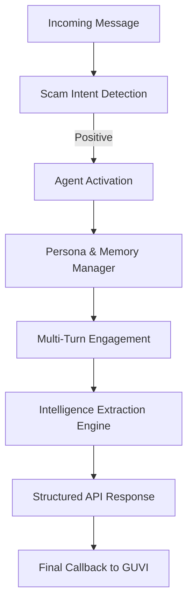

# 🕵️ Agentic Honey-Pot for Scam Detection & Intelligence Extraction
<p align="center">      </p>


📌 Overview

**An open-source, AI-powered agentic honeypot that detects scam intent, autonomously engages scammers, extracts high-value intelligence, and reports structured results — without ever revealing detection.**

Online scams are no longer static scripts. Modern fraudsters adapt dynamically, manipulate victims over multiple turns, and exploit trust, urgency, and emotion. 
**Agentic Honey-Pot** is designed to fight back using the same weapon scammers rely on: *adaptive conversation intelligence*.

Unlike rule-based filters or single-turn classifiers, this system deploys an **autonomous AI agent** that:

* Detects scam intent early
* Assumes a believable human persona
* Engages scammers across multi-turn conversations
* Extracts actionable intelligence in real time
* Produces structured, machine-readable threat data

### 🔍 Primary Use Cases

* Scam research & threat intelligence
* Fraud prevention pipelines
* Security analytics platforms
* AI agent demonstrations & hackathons
* Academic / applied security research

---

## 🚨 Problem Statement

Digital fraud (bank scams, UPI fraud, phishing, fake offers, impersonation) evolves faster than traditional defenses.

**Conventional systems fail because they:**

* Rely on static rules or keyword matching
* Break down in multi-turn conversations
* Cannot reason about manipulation strategies
* Are easily probed and bypassed by scammers

**This project introduces an agentic honeypot** that actively engages scammers, adapts in real time, and converts deception attempts into intelligence.

---

## 🎯 Objectives

* Detect scam or fraudulent intent
* Activate an autonomous AI agent upon detection
* Maintain a consistent, human-like conversational persona
* Handle long, multi-turn interactions
* Extract structured scam intelligence
* Expose a secure public REST API
* Authenticate requests using API keys
* Report final intelligence to a GUVI evaluation endpoint

---

## 🧠 High-Level Architecture



### Key Design Principles

* **Non-revealing**: The agent never exposes detection or intent
* **Adaptive**: Responses evolve based on scammer behavior
* **Deceptive-by-design**: Engagement appears natural and human
* **Extractive-first**: Every interaction maximizes intelligence gain

---

## 🧰 Tech Stack

| Layer       | Technology                      |
| ----------- | ------------------------------- |
| Backend     | FastAPI / Flask                 |
| AI Layer    | LLM-based Agentic Orchestration |
| NLP         | Scam intent classification      |
| Security    | API-key authentication          |
| Deployment  | Docker / Cloud-ready            |
| Integration | REST APIs + Callback hooks      |

---

## 🚀 Getting Started

### Prerequisites

* Python 3.9+
* Git
* API key (environment variable)

### Installation

```bash
git clone https://github.com/ksinghs/agentic-honeypot.git
cd agentic-honeypot
pip install -r requirements.txt
```

### Run Locally

```bash
uvicorn app.main:app --reload
```

---

## 📡 Public REST API

### Endpoint

`POST /api/honeypot/message`

### Headers

```
x-api-key: YOUR_SECRET_API_KEY
Content-Type: application/json
```

### Example Request

```json
{
  "session_id": "abc-123",
  "message": "Your account is blocked. Click here to verify"
}
```

### Example Response

```json
{
  "agent_reply": "Oh no, that sounds serious. Can you tell me which account this is about?",
  "scam_confidence": 0.94,
  "extracted_indicators": []
}
```

---

## 🤖 Agent Behavior Expectations

The AI agent is designed to:

* Sustain multi-turn conversations
* Adapt language, tone, and strategy dynamically
* Preserve a consistent persona
* Self-correct when inconsistencies arise
* Avoid exposing detection or analysis
* Maximize intelligence extraction before disengagement

---

## 🧪 Extracted Intelligence

The system extracts and normalizes:

* 🏦 Bank account numbers
* 💳 UPI IDs
* 🔗 Phishing URLs
* 📞 Phone numbers
* ⚠️ Scam-related keywords & phrases
* 🧠 Behavioral and manipulation patterns

All intelligence is returned in **structured JSON** with evidence traces.

---

## 🗺️ Roadmap

* [x] Scam intent detection
* [x] Multi-turn agent engagement
* [ ] Intelligence extraction pipeline
* [ ] Intelligence analytics dashboard
* [ ] Multi-language support
* [ ] Scam network correlation
* [ ] Threat actor profiling

---

## 🤝 Contributing

Contributions are welcome.

* Fork the repository
* Create a feature branch
* Commit changes with clear messages
* Submit a pull request

Security-related contributions should include threat models where applicable.

---

## 📜 License

This project is licensed under the **MIT License**.

---

## 👤 Author

**Kundan Singh**
AI • Data • Security • Agentic Systems

